<h1>vachan18@living-terminal</h1>

	<code>AI Engineer</code> · <code>Automation Builder</code> · <code>Systems Thinker</code>

<pre>
$ uname -a
vachan18 | AI Engineer | Bengaluru, India

$ status
building living interfaces, automation systems, and AI products
</pre>

<pre>
┌─[ whoami ]────────────────────────────────────────────────────┐
│                                                               │
│  avatar                                                        │
│                                                               │
└───────────────────────────────────────────────────────────────┘
</pre>

 

<pre>
┌─[ system.info ]───────────────────────────────────────────────┐
│                                                               │
│  runtime                                                       │
│                                                               │
└───────────────────────────────────────────────────────────────┘
</pre>

  

<pre>
┌─[ cat contributions.log ]─────────────────────────────────────┐
│                                                               │
│  activity                                                      │
│                                                               │
└───────────────────────────────────────────────────────────────┘
</pre>

