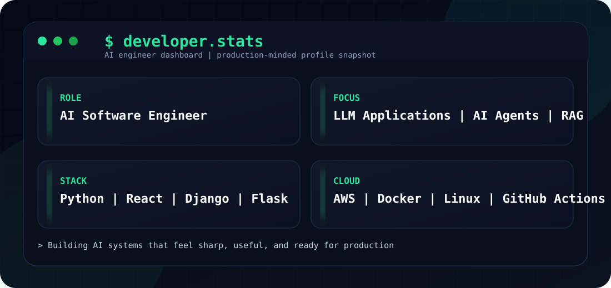

<code>AI SOFTWARE ENGINEER | GENERATIVE AI | LLM APPLICATIONS</code>

<h1>Vachan U S</h1>

<strong>
Engineering AI-powered applications, automation systems, and scalable backend solutions.
</strong>

<code>LLMs</code> ·
<code>AI Agents</code> ·
<code>RAG</code> ·
<code>Automation</code> ·
<code>Backend</code> ·
<code>Cloud</code>

 

  

# 🖥️ $ whoami

 

<pre>
identity:

name        : Vachan U S
role        : Junior Software Engineer
speciality  : AI Engineering & LLM Applications
location    : Bengaluru, India

mission:
building reliable AI systems that transform ideas into products
</pre>

 

  

# 🧬 $ neural.stack

<pre>

AI ENGINEERING
--------------
LLM Applications
Generative AI
AI Agents
RAG Pipelines
Embeddings
Vector Databases
Prompt Engineering
LangChain
CrewAI
OpenAI API
Claude API
Groq API

SOFTWARE ENGINEERING
--------------------
Python
Django
Flask
REST APIs
SQL
React
JavaScript

INFRASTRUCTURE
--------------
AWS
Docker
Linux
GitHub Actions
CI/CD

</pre>

 

# ⚙️ $ runtime.env

<pre>

environment:

languages:
  Python
  JavaScript

frameworks:
  Django
  Flask
  React

cloud:
  AWS

tools:
  Git
  Docker
  Linux

status:
  building production-ready AI applications

</pre>

 

# 📡 $ build.log

<pre>

[2026]

✓ Developed LLM-powered applications

✓ Built AI automation workflows

✓ Integrated multiple AI model APIs

✓ Designed backend systems and APIs

✓ Worked with cloud deployment workflows

✓ Published AI-based research work

</pre>

 

# 🔮 $ learning.queue

<pre>

CURRENTLY EXPLORING:

01 → AI Agent Architectures

02 → Retrieval Augmented Generation (RAG)

03 → LLM Application Scaling

04 → Cloud Native Systems

05 → Intelligent Automation

</pre>

 

# 📊 $ system.metrics

<pre>

developer_profile:

focus:
AI Engineering

specialization:
Generative AI + Backend Systems

engineering_style:
Product-focused
Production-minded
Automation-driven

objective:
Create useful intelligent software

</pre>

 

# 🛰️ $ mission.control

<pre>

primary_objective:

→ Build intelligent software systems using AI

active_focus:

→ AI Agents
→ LLM Applications
→ Retrieval Augmented Generation
→ Automation Workflows
→ Cloud-based Systems

engineering_principles:

→ Reliable
→ Scalable
→ Production-ready

</pre>

 

# 📈 $ contribution.stream

 

# 🌐 $ connect

<a href="https://www.linkedin.com/in/vachan-u-s-0a5aa8128/">
LinkedIn
</a>

&nbsp;|&nbsp;

<a href="https://portfolio-app.ai.studio">
Portfolio
</a>

&nbsp;|&nbsp;

<a href="mailto:vachanus@gmail.com">
Email
</a>

 

<h3>
⚡ Building intelligent systems, one commit at a time.
</h3>

